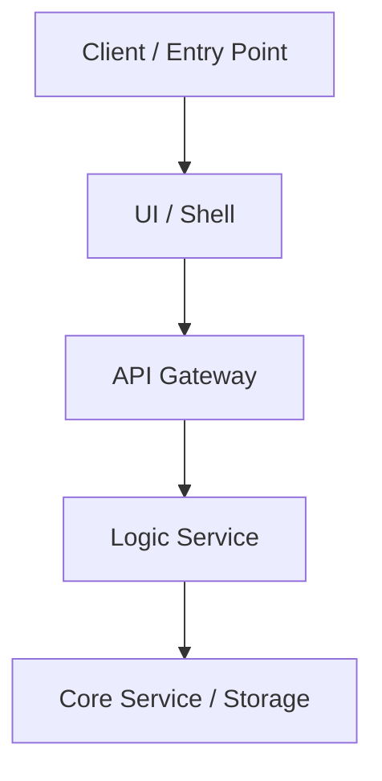

# MS-CORE-{FEATURE_ID}: {Feature Name}

> **Package Version**: r1
> **Package Status**: Draft / Approved
> **Supersedes**: -
> **Source PRD**: `temp/{FEATURE_ID}/prd.md`

This document is the shared-baseline hub for the feature.

Read this file first to understand:

- what the feature is changing
- why it is changing
- the main user and system flow
- the key decisions and blockers
- which supporting artifacts hold deeper detail

Supporting artifacts:

- `knowledge.md`
- `open-questions.md`
- `api-contract.md`

---

## 1. Document Metadata

| Field | Value |
|-------|-------|
| Feature ID | {FEATURE_ID} |
| Feature Name | {Feature Name} |
| Owner | |
| Package Version | r1 |
| Package Status | Draft |
| Supersedes | - |
| Source PRD | `temp/{FEATURE_ID}/prd.md` |
| Created | |
| Last Updated | |
| Approved At | — |

## 2. One-Minute Readout

- Main change:
- Current package status:
- Main blockers:
- Backend impact:
- Supporting artifacts:

## 3. What Changes

- 

## 4. Why

### 4.1 Business Objective

- 

### 4.2 Target Users

- 

## 5. Shared Flow

### 5.1 Primary Flow

Render a Mermaid `flowchart TD` that shows the shared baseline flow from client entry point to main backend services.

Keep it short and readable.

Suggested shape:



### 5.2 Flow Notes

- Client surfaces:
- Main services:
- Key API path:
- New backend work:
- Important alternate or suppressed paths:

## 6. Key Decisions

| Area | Current Decision | Status | Supporting Artifact |
|------|------------------|--------|---------------------|
|  |  |  |  |

## 7. Blockers / Follow-Up

### 7.1 Blocking Items

| ID | What Still Needs A Decision | Current Handling | Supporting Artifact |
|----|-----------------------------|------------------|---------------------|
|  |  |  |  |

### 7.2 Non-Blocking Follow-Up

| ID / Ref | Follow-Up | Current Handling | Supporting Artifact |
|----------|-----------|------------------|---------------------|
|  |  |  |  |

## 8. Example Details

### 8.1 Example Summary

| Ref | Scenario | Why It Matters |
|-----|----------|----------------|
|  |  |  |

### 8.2 Example Details

#### EX-001 — {Example title}

```gherkin
Given
When
Then
```

- Notes:
- Supporting refs:

## 9. Supporting Artifacts

| Artifact | Purpose | Notes |
|----------|---------|-------|
| `knowledge.md` | Supporting context | |
| `open-questions.md` | Ambiguity and blockers | |
| `api-contract.md` | API and backend contract baseline | |
