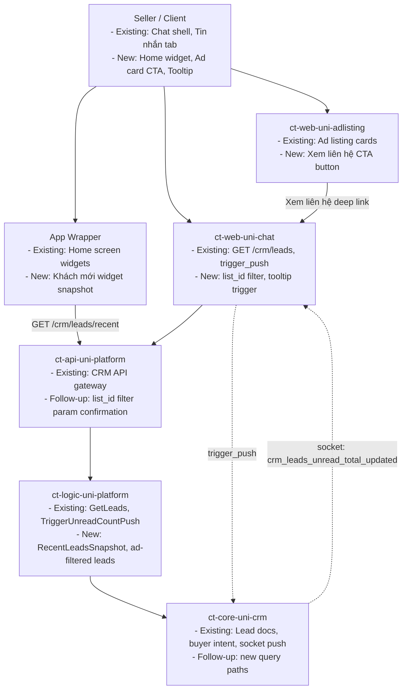

# API-CONTRACT-PLMO-1328: Redesign Khách Tab as a Toggle and show Contextual Tooltip

> Extends: `MS-CORE-PLMO-1328`
> Artifact: Shared API Contract
> Owner: Product / Backend / Client Leads
> Master Spec Package Version: r1
> Package Status: Draft

This artifact is the human-readable contract decision log for the current package baseline.

Use it to answer these questions quickly:

- Is any new backend surface required?
- Which existing APIs or events are confirmed for reuse?
- Which items are still pending product or backend decisions?
- Which unresolved items are blocking the shared baseline?

---

## 1. Contract Metadata

| Field | Value |
|-------|-------|
| Feature ID | PLMO-1328 |
| Feature Name | Redesign Khách Tab as a Toggle and show Contextual Tooltip |
| Package Version | r1 |
| Package Status | Draft |
| Source PRD | `features/PLMO-1328/prd.md` |
| Last Updated | 2026-04-15 |
| Owners | Minh Tin Trieu (PIC), Pham Thi Ngoc Anh (QA), Vo Ngoc Tin (CC) |

---

## 2. Contract Readout

### 2.1 One-Minute Summary

- New backend work required: Yes — 2 new endpoints + 1 new event binding; 1 event deferred
- Confirmed reuse bindings: 5 existing CRM lead APIs, ad listing APIs
- Pending business contract decisions: 3 blocking OQ items (experiment gating, subscription gating, tooltip trigger definition)
- Telemetry follow-up: `TBD` — tooltip impression and CTA tap events need event name confirmation

### 2.2 Decision Summary

| Item | Type | Status | Current Readout | Decision Driver / Reference |
|------|------|--------|-----------------|-----------------------------|
| API-001 | Business API | New endpoint required | `GET /api-platform/private/crm/leads` with `list_id` filter — no existing binding confirmed | Backend review; overlaps STORY-003 (PLMO-1237) |
| API-002 | Business API | Pending decision | Deep-link URL scheme to Khách tab with ad-filter context not confirmed | OQ-001, OQ-002 |
| API-003 | Business API | New endpoint required | `GET /api-platform/private/crm/leads/recent` for home widget snapshot | Backend review |
| API-004 | Business API | Confirmed reuse | `POST /api-platform/private/crm/unread_count:trigger_push` already handles badge push | CRM team confirmed |
| API-005 | Business API | Pending decision | Daily push campaign type not a standalone API contract; Confirmed reuse of existing Comm platform scheduling | OQ-005, Communication team |
| TEL-001 | Telemetry | Waiting for event | Tooltip impression event — name and schema not yet confirmed | Data review |

---

## 3. Business Contract Items

### 3.1 API-001 — CRM Leads filtered by Ad (Xem liên hệ)

- Status: `New endpoint required`
- Purpose: Fetch CRM leads for a specific ad listing so that tapping "Xem liên hệ" on an ad card shows leads filtered by that ad
- Consumers: `ct-web-uni-chat` (CRM workspace), `ct-web-uni-adlisting` (ad card CTA)
- Current Readout: No existing `list_id` filter binding on `GET /crm/leads` confirmed. Net new filter param needed or dedicated endpoint.
- Decision Driver / Reference: Backend review; overlaps with PLMO-1237 (STORY-003) which tracks "Filter Leads by Ad" as a separate story

#### Draft Request

| Field | Type | Required | Validation | Notes |
|-------|------|----------|------------|-------|
| `list_id` | `string` | Yes | Must be valid ad listing ID owned by authenticated seller | Filters leads to those who interacted with this specific ad |
| `is_read` | `boolean` | No | — | Optional filter for unread leads only |
| `limit` | `number` | No | Default 20, max 100 | Pagination |
| `offset` | `number` | No | Default 0 | Pagination |

###### Request Example

```json
{
  "list_id": "87654321",
  "is_read": false,
  "limit": 20,
  "offset": 0
}
```

##### Draft Success Response

| Field | Type | Required | Description |
|-------|------|----------|-------------|
| `leads` | `Lead[]` | Yes | Array of CRM lead records matching the ad filter |
| `total` | `number` | Yes | Total count of matching leads |
| `total_unread` | `number` | Yes | Count of unread leads in this filter set |

###### Success Example

```json
{
  "leads": [
    {
      "buyer_id": "buyer_123",
      "buyer_oid": "oid_456",
      "buyer_name": "Nguyen Van A",
      "is_read": false,
      "status": "Chưa liên hệ",
      "contact_intent": "make_lead_chat",
      "interested_ads": [
        {
          "list_id": "87654321",
          "ad_title": "Căn hộ cao cấp Quận 7",
          "thumbnail": "https://...",
          "event_time": "2026-04-14T10:00:00Z"
        }
      ]
    }
  ],
  "total": 5,
  "total_unread": 3
}
```

##### Error / Failure Handling

| Error Code | HTTP / Status | Meaning | Client Handling |
|------------|---------------|---------|-----------------|
| `LEAD_NOT_FOUND` | 404 | No leads found for this ad | Return empty array, not error |
| `AD_NOT_OWNED` | 403 | Seller does not own this ad | Hide CTA or show access-denied state |

---

### 3.2 API-002 — Deep-link URL to Khách Tab with Ad Context

- Status: `Pending decision`
- Purpose: Establish a stable deep-link URL scheme for "Xem liên hệ" CTA on ad cards and "Khách mới" widget that navigates to Khách tab pre-filtered by ad or showing recent leads
- Consumers: `ct-web-uni-adlisting`, App Wrapper home screen
- Current Readout: `No standalone request shape confirmed yet.`
- Decision Driver / Reference: OQ-001 (experiment treatment gating), OQ-002 (subscription gating)

#### Linked Question

- Linked Question: OQ-001, OQ-002
- Pending Decision: What URL scheme? Does deep link respect CRM experiment treatment? Is it subscription-gated?
- Current Readout: `No standalone request shape confirmed yet.`

---

### 3.3 API-003 — Recent Leads Snapshot for Home Widget

- Status: `New endpoint required`
- Purpose: Fetch a compact snapshot of recent CRM leads for the "Khách mới" widget on seller's Trang chủ home screen
- Consumers: App Wrapper (Trang chủ home screen)
- Current Readout: No existing endpoint returns a compact recent-leads snapshot for widget use. Defaults to new endpoint.
- Decision Driver / Reference: Backend review

#### Draft Request

| Field | Type | Required | Validation | Notes |
|-------|------|----------|------------|-------|
| `limit` | `number` | No | Default 5, max 10 | Number of recent leads to return |
| `unread_only` | `boolean` | No | Default `true` | Only return unread leads |

###### Request Example

```json
{
  "limit": 5,
  "unread_only": true
}
```

##### Draft Success Response

| Field | Type | Required | Description |
|-------|------|----------|-------------|
| `leads` | `CompactLead[]` | Yes | Short list of recent leads |
| `total_unread` | `number` | Yes | Total unread count across all leads |
| `last_updated` | `timestamp` | Yes | When data was last refreshed |

###### Success Example

```json
{
  "leads": [
    {
      "buyer_id": "buyer_123",
      "buyer_name": "Nguyen Van A",
      "is_read": false,
      "top_ad_title": "Căn hộ cao cấp Quận 7",
      "top_ad_thumbnail": "https://...",
      "event_time": "2026-04-14T10:00:00Z"
    }
  ],
  "total_unread": 12,
  "last_updated": "2026-04-15T08:00:00Z"
}
```

##### Error / Failure Handling

| Error Code | HTTP / Status | Meaning | Client Handling |
|------------|---------------|---------|-----------------|
| `NO_LEADS` | 200 | Seller has no CRM leads | Return empty array; widget hidden per OQ-006 |
| `CRM_NOT_ENABLED` | 403 | Seller not in CRM experiment treatment | Widget not rendered |

---

### 3.4 API-004 — CRM Unread Count Push (Confirmed Reuse)

- Status: `Confirmed reuse`
- Purpose: Trigger and maintain real-time CRM unread badge counts on toggle tabs
- Consumers: `ct-web-uni-chat` (shell), mobile clients
- Current Readout: Existing `POST /api-platform/private/crm/unread_count:trigger_push` handles this
- Decision Driver / Reference: CRM team confirmed existing binding

#### Existing Binding

- Existing Binding: `POST /api-platform/private/crm/unread_count:trigger_push` — `ct-logic-uni-platform.GetTriggerUnreadCountPush`
- Consumed Fields: `seller_id`, returns `total_unread` for badge rendering
- Notes: Already push-driven via socket `crm_leads_unread_total_updated`. No new contract needed.

---

### 3.5 API-005 — Daily Morning Push Notification (Non-Blocking)

- Status: `Pending decision`
- Purpose: Daily scheduled push notification summarizing new leads from past 24 hours
- Consumers: Communication platform → mobile push infrastructure
- Current Readout: `POST /api-platform/private/crm/unread_count:trigger_push` reuse or new scheduled campaign type in Comm platform not confirmed
- Decision Driver / Reference: OQ-005 (push content), Communication team review

#### Linked Question

- Linked Question: OQ-005
- Pending Decision: Push content format (count only vs. top leads with ad names); scheduled campaign type in Comm platform
- Current Readout: `No standalone request shape confirmed yet.`

---

## 4. Telemetry / Analytics Contract

### 4.1 TEL-001 — Tooltip Impression & CTA Tap Tracking

- Status: `Waiting for event`
- Purpose: Track when tooltip is shown, clicked, and when "Xem liên hệ" CTA is tapped from ad cards
- Producers / Consumers: `ct-web-uni-chat` (tooltip), `ct-web-uni-adlisting` (CTA)
- Current Readout: `No final event name or payload contract confirmed yet.`
- Decision Driver / Reference: Data review

#### Telemetry Register

| Field | Value |
|-------|-------|
| Feature | PLMO-1328 |
| Event Name | `crm_tooltip_impression`, `crm_tooltip_click`, `crm_ad_cta_click` |
| Trigger Point | Tooltip shown on Liên hệ page; tooltip clicked; "Xem liên hệ" tapped on ad card |
| Status | Waiting for event |
| Platform Notes | Event schema TBD by Data team |
| Follow-Up | Confirm event names and trigger conditions through `/complete-master-spec` once Data team reviews |

If the event is `Waiting for event`:

- Keep the business intent explicit.
- Record the expected `feature` and proposed `event_name` only if Product / Data has already suggested one.
- Use `/complete-master-spec` to fill the final event binding once Product / Data confirms it.
- Do not auto-generate the event, auto-confirm the name, or invent ECS payload details during package generation or completion.
- Keep the item rendered as a telemetry need or follow-up, not as proof that a real event already exists.

---

## 5. Shared Contract Rules

| Ref | Rule | Enforcement Point | Notes |
|-----|------|-------------------|-------|
| API-001 | Lead ad-filter must validate seller ownership of `list_id` | `ct-logic-uni-platform` | Prevent sellers from viewing leads on ads they don't own |
| API-003 | Widget snapshot must respect CRM experiment treatment gating | App Wrapper + `ct-api-uni-platform` | Only render for treatment group per OQ-001 |
| API-003 | Widget snapshot must check subscription entitlement | App Wrapper + `ct-logic-uni` | Fallback to upgrade prompt if no subscription per OQ-002 |

---

## 6. Auth / Integration Constraints

| Area | Decision | Notes |
|------|----------|-------|
| Authentication | Session/token required on all endpoints | Same auth as existing CRM APIs |
| Authorization | CRM leads gated by experiment treatment; new entry points need alignment (OQ-001) | Entry points may bypass chat shell — experiment integrity at risk |
| Session / Token | Seller JWT via `ct-api-uni-platform` | Same pattern as existing CRM endpoints |
| Integration Dependency | `ct-logic-uni-platform` (CRM orchestration), `ct-core-uni-crm` (MongoDB) | Same backend stack as existing CRM |
| Retry / Fallback | Widget: show cached data or hide on API failure | OQ-006 empty state applies |

---

## 7. Contract Assumptions / Review Notes

### 7.1 Assumptions

- [ ] C-001: "Xem liên hệ" deep link will use URL scheme like `/crm-leading?list_id=<ad_id>` — subject to OQ-001/OQ-002 resolution
- [ ] C-002: "Khách mới" widget will be rendered by App Wrapper on Trang chủ using `GET /crm/leads/recent` snapshot
- [ ] C-003: Daily push notification will be a new scheduled campaign type in Communication platform — content TBD (OQ-005)

### 7.2 Review Notes

- STORY-003 (Filter Leads by Ad) is tracked separately in PLMO-1237 — API-001 overlaps with this and may be resolved or consolidated there
- Tooltip feature (STORY-001) is blocked on OQ-003 definition of "first-time daily visit" — if unresolved, tooltip is deferred from r1
- Experiment treatment gating (OQ-001) is critical for API-002 and API-003 — home widget and ad CTA entry points must not bypass experiment

### 7.3 Items That Must Be Tracked In `open-questions.md`

| Item | Why It Needs A Decision | Linked Question |
|------|--------------------------|-----------------|
| Experiment treatment gating for new entry points | API-002 deep link and API-003 widget depend on this | OQ-001 |
| Subscription enforcement on widget and CTA | API-002 and API-003 access control | OQ-002 |
| "First-time daily visit" definition | Telemetry and UX behavior for tooltip | OQ-003 |

---

## 8. Service Flow Diagram



### Node Labels Explained

| Node | Existing | New | Follow-up |
|------|----------|-----|-----------|
| Seller / Client | Chat shell, Tin nhắn tab | Home widget, Ad card CTA, Tooltip | — |
| ct-web-uni-chat | GET /crm/leads, trigger_push | list_id filter support, tooltip trigger state | Tooltip event naming |
| ct-web-uni-adlisting | Ad listing cards | "Xem liên hệ" CTA button | Deep-link URL scheme |
| App Wrapper | Home screen widgets | "Khách mới" widget snapshot | Widget eligibility (exp/sub) |
| ct-api-uni-platform | CRM API gateway | list_id filter param | Confirmation of new query path |
| ct-logic-uni-platform | GetLeads, TriggerUnreadCountPush | RecentLeadsSnapshot, ad-filtered leads | — |
| ct-core-uni-crm | Lead docs, buyer intent, socket push | New query paths for recent snapshot | — |
