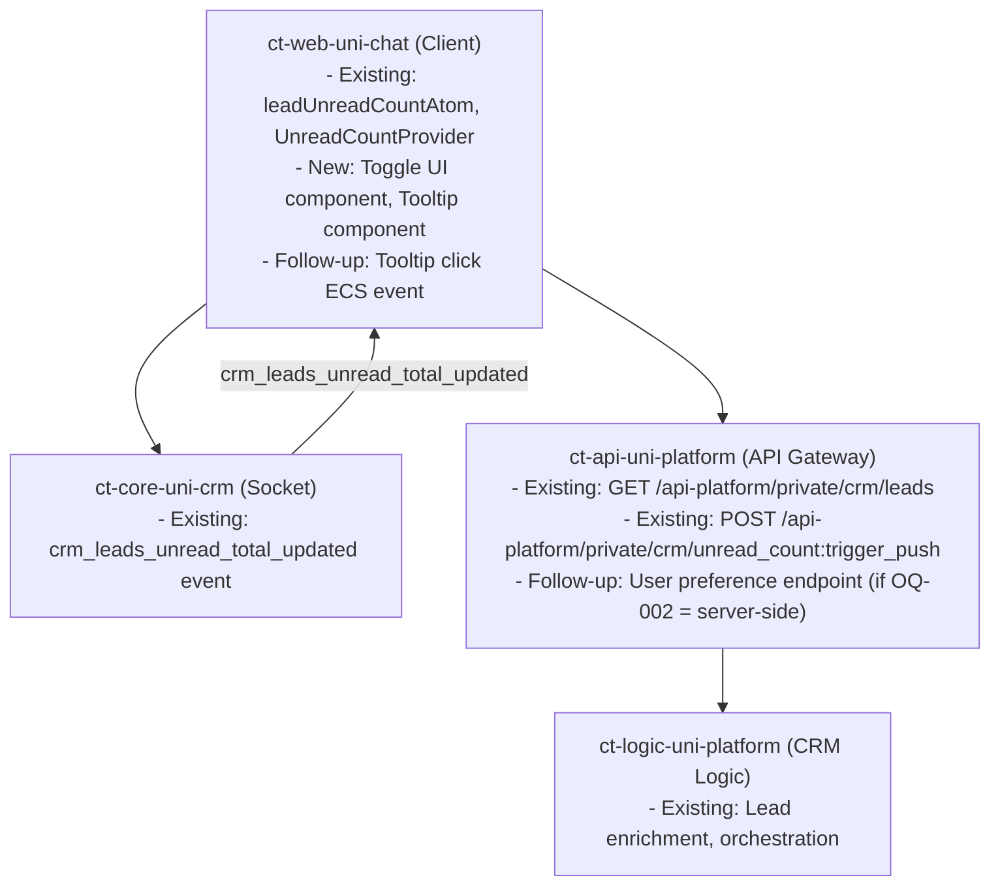

# API-CONTRACT-PLMO-1328: Redesign Khách Tab as a Toggle and show Contextual Tooltip

> Extends: `MS-CORE-PLMO-1328`
> Artifact: Shared API Contract
> Owner: Product / Backend / Client Leads
> Master Spec Package Version: `r1`
> Package Status: Draft

---

## 1. Contract Metadata

| Field | Value |
|-------|-------|
| Feature ID | PLMO-1328 |
| Feature Name | Redesign Khách Tab as a Toggle and show Contextual Tooltip |
| Package Version | r1 |
| Package Status | Draft |
| Source PRD | `temp/PLMO-1328/prd.md` (STORY-001) |
| Last Updated | 2026-04-16 |
| Owners | Minh Tin Trieu (FE), Pham Thi Ngoc Anh (QA RT) |

---

## 2. Contract Readout

### 2.1 One-Minute Summary

- New backend work required: Likely none — feature is primarily UI + client-side state
- Confirmed reuse bindings: `GET /api-platform/private/crm/leads` (existing), `crm_leads_unread_total_updated` socket event (existing)
- Pending business contract decisions: Tooltip "shown today" state persistence (OQ-002) — client vs server
- Telemetry follow-up: Tooltip interaction tracking may need ECS event (OQ-006)

### 2.2 Decision Summary

| Item | Type | Status | Current Readout | Decision Driver / Reference |
|------|------|--------|-----------------|-----------------------------|
| API-001 | Tooltip state | Pending decision | No confirmed binding — defaulting to client-side (localStorage) | OQ-002 |
| API-002 | CRM unread count | Confirmed reuse | `crm_leads_unread_total_updated` socket + `leadUnreadCountAtom` | knowledge.md |
| API-003 | CRM lead list | Confirmed reuse | `GET /api-platform/private/crm/leads` | knowledge.md |
| API-004 | Toggle UI | Not needed | Pure frontend component change, no backend contract | — |
| TEL-001 | Tooltip interaction tracking | Pending decision | ECS event for tooltip click may be needed | OQ-006 |

---

## 3. Business Contract Items

### 3.1 API-001 — Tooltip "Shown Today" State Persistence

- Status: `Pending decision`
- Purpose: Track whether the contextual tooltip has already been shown to the user on the current day to avoid repeated nudges.
- Consumers: ct-web-uni-chat (CRM Leading page)
- Current Readout: `No standalone request shape confirmed yet.` Defaults to client-side localStorage until a decision is made.
- Decision Driver / Reference: OQ-002

#### If Status = Pending decision

- Linked Question: OQ-002 — Tooltip state storage (client-side vs server-side)
- Pending Decision: Should the "tooltip shown today" flag be stored client-side (localStorage, resets per device) or server-side via a user preference API (persists across devices)?
- Current Readout: `No standalone request shape confirmed yet.` Defaulting to client-side localStorage. If cross-device sync is required, a new user-preference endpoint on the API gateway is needed.

#### Telemetry implication of API-001

If server-side: a new `PUT /api-platform/private/user-preferences` or similar endpoint may be needed.
If client-side: no new backend contract.

---

### 3.2 API-002 — CRM Unread Count (Confirmed Reuse)

- Status: `Confirmed reuse`
- Purpose: Determine whether the contextual tooltip should be shown based on whether unread CRM leads exist.
- Consumers: ct-web-uni-chat (UnreadCountProvider, CRMLeading page)

#### Existing Binding

- Socket event: `crm_leads_unread_total_updated` — pushed from `ct-core-uni-crm` to `ct-web-uni-chat`
- Client state: `leadUnreadCountAtom` (set via `UnreadCountProvider.tsx`)
- Notes: The tooltip trigger condition "there are unread leads" reads from `leadUnreadCountAtom`. The tooltip number should match the badge count from the same atom.

---

### 3.3 API-003 — CRM Lead List (Confirmed Reuse)

- Status: `Confirmed reuse`
- Purpose: Display the lead list when user navigates to Khách tab via tooltip click.
- Consumers: ct-web-uni-chat (CRMLeading components)

#### Existing Binding

- Endpoint: `GET /api-platform/private/crm/leads`
- Service: ct-api-uni-platform
- Consumed Fields: `leads[].buyerId`, `leads[].accountOid`, `leads[].status`, `leads[].createdAt`
- Notes: No new endpoint required. The toggle navigation routes to existing `/crm-leading` page which already calls this endpoint.

---

### 3.4 API-004 — Toggle UI State

- Status: `Not needed`
- Purpose: Toggle between Tin nhắn and Khách tab views.
- Current Readout: Pure frontend component state change in `AppShell/index.tsx` and CRM leading page. No backend contract required.
- Notes: The toggle is a UI pattern change only. The existing route `/crm-leading` remains the same.

---

## 4. Telemetry / Analytics Contract

### 4.1 TEL-001 — Tooltip Interaction Tracking

- Status: `Pending decision`
- Purpose: Track when a user clicks the contextual tooltip to navigate to the Khách tab, to measure tooltip effectiveness.
- Producers / Consumers: ct-web-uni-chat (frontend emits), ct-core-uni-crm (event ingestion)
- Current Readout: `No final event name or payload contract confirmed yet.` PRD does not specify an ECS event for tooltip interactions.
- Decision Driver / Reference: OQ-006 — Tooltip dismissibility and re-show behavior

#### Telemetry Register

| Field | Value |
|-------|-------|
| Feature | lead_management |
| Event Name | `lead_mgmt_crm_tooltip_click` (proposed, not confirmed) |
| Trigger Point | User clicks the "X khách mới đang đợi bạn" tooltip |
| Status | Pending decision |
| Platform Notes | PRD STORY-001 does not specify telemetry for tooltip. Needs PM/Data confirmation. |
| Follow-Up | Confirm ECS event name and payload with Data team via `/complete-master-spec` |

---

## 5. Shared Contract Rules

| Ref | Rule | Enforcement Point | Notes |
|-----|------|-------------------|-------|
| API-002 | Tooltip number must match `leadUnreadCountAtom` badge count | Frontend (read from existing atom) | Consistency across tooltip and shell badge |
| API-003 | Lead list via existing `/crm/leads` endpoint | ct-web-uni-chat CRMLeading page | No new endpoint |

---

## 6. Auth / Integration Constraints

| Area | Decision | Notes |
|------|----------|-------|
| Authentication | Required | Same auth check as existing `/crm-leading` — `UnreadCountProvider` already handles |
| Authorization | Experiment-gated | `CT-PLATFORM.ab_collect_lead_lead_pty` treatment group only (same as existing Khách tab) |
| Session / Token | Existing | Uses standard seller session token |
| Integration Dependency | `crm_leads_unread_total_updated` socket event | Existing; must remain active for tooltip trigger logic |
| Retry / Fallback | Show tooltip only when socket confirms unread > 0 | If socket fails, default to not showing tooltip |

---

## 7. Contract Assumptions / Review Notes

### 7.1 Assumptions

- [ ] C-001: Tooltip reads unread count from `leadUnreadCountAtom` (same source as shell badge). No new API call needed for trigger condition.
- [ ] C-002: Tooltip "shown today" state defaults to localStorage (client-side only) unless OQ-002 resolves to server-side.
- [ ] C-003: Tooltip click navigates to existing `/crm-leading` route — same page, no new endpoint.

### 7.2 Review Notes

- The toggle redesign is a pure frontend change with no new backend surface.
- The main open contract question is tooltip state persistence (API-001).
- Telemetry (TEL-001) is likely needed for tooltip effectiveness measurement but is not specified in the PRD.

### 7.3 Items That Must Be Tracked In `open-questions.md`

| Item | Why It Needs A Decision | Linked Question |
|------|--------------------------|-----------------|
| Tooltip state storage | Affects whether a new backend endpoint is needed | OQ-002 |
| Tooltip ECS event | Affects telemetry baseline | OQ-006 |

---

## 8. Service Flow Diagram

