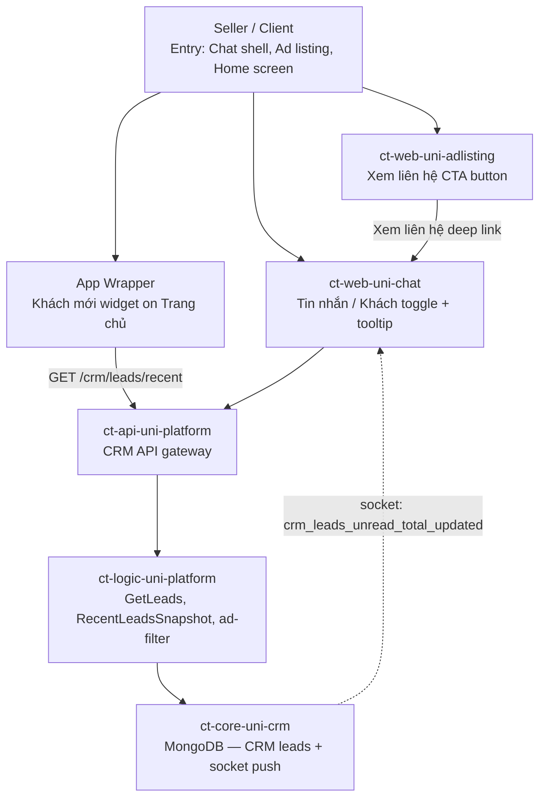

# MS-CORE-PLMO-1328: Redesign Khách Tab as a Toggle and show Contextual Tooltip

> **Package Version**: r1
> **Package Status**: Draft
> **Supersedes**: -
> **Source PRD**: `temp/PLMO-1328/prd.md`

This document is the shared-baseline hub for the feature.

Read this file first to understand:

- what the feature is changing
- why it is changing
- the main user and system flow
- the key decisions and blockers
- which supporting artifacts hold deeper detail

Supporting artifacts:

- `knowledge.md`
- `open-questions.md`
- `api-contract.md`

---

## 1. Document Metadata

| Field | Value |
|-------|-------|
| Feature ID | PLMO-1328 |
| Feature Name | Redesign Khách Tab as a Toggle and show Contextual Tooltip |
| Owner | Minh Tin Trieu (PIC), Pham Thi Ngoc Anh (QA), Vo Ngoc Tin (CC) |
| Package Version | r1 |
| Package Status | Draft |
| Supersedes | - |
| Source PRD | `temp/PLMO-1328/prd.md` |
| Created | 2026-04-15 |
| Last Updated | 2026-04-15 |
| Approved At | — |

---

## 2. One-Minute Readout

- **Main change**: Redesign the Tin nhắn/Khách tab pair as equal-weight toggles with badge counts; add contextual tooltip on Liên hệ page for first-time daily visitors; add "Xem liên hệ" CTA on ad listing cards; add "Khách mới" widget on home screen; send daily morning push notification.
- **Current package status**: Draft — 3 blocking open questions (OQ-001, OQ-002, OQ-003) defer tooltip, widget, and CTA entry points.
- **Main blockers**: (1) Should new entry points respect CRM experiment treatment? (2) Should widget/CTA be subscription-gated? (3) What defines "first-time daily visit" for tooltip trigger?
- **Backend impact**: 2 new endpoints required (`GET /crm/leads` with `list_id` filter, `GET /crm/leads/recent` for widget snapshot); 1 event deferred (daily push); confirmed reuse of 5 existing CRM APIs.
- **Supporting artifacts**: `knowledge.md`, `open-questions.md`, `api-contract.md`

---

## 3. What Changes

- **Tab redesign**: Tin nhắn and Khách tabs rendered as equal-weight toggle with yellow color highlight and badge counts; filter labels changed to outline style.
- **Contextual tooltip**: Tooltip shown on Liên hệ page when seller is on Tin nhắn tab, has unread leads, and it is their first visit of the day (after 12h). Tooltip content: "X khách mới đang đợi bạn Nhấn để xem thông tin và tư vấn ngay."
- **"Xem liên hệ" CTA**: Button added to each ad listing card in Quản lý tin that deep-links to Khách tab filtered by that ad's leads.
- **"Khách mới" home widget**: Card/widget added to seller's Trang chủ home screen showing recent leads snapshot and linking to Khách tab.
- **Daily morning push**: Scheduled push notification summarizing new leads from past 24 hours.
- **STORY-003 (Filter Leads by Ad)** tracked separately in PLMO-1237.

---

## 4. Why

### 4.1 Business Objective

Only ~50% of PTY sellers in the CRM A/B treatment group are aware of the Khách tab feature, even after it has been live. Sellers who discover it don't develop a habit of returning daily. The redesign aims to increase lead discovery through:

1. Better visual treatment — toggle design with yellow highlight signals equal-weight navigation.
2. First-time education — contextual tooltip guides sellers to their unread leads.
3. New entry points — ad CTAs and home widget reduce friction for lead discovery.
4. Re-engagement — daily morning push brings sellers back to their new leads.

### 4.2 Target Users

- **Primary**: PTY sellers in the CRM-enabled experiment treatment group who have active ad listings and receive buyer inquiries.
- **Secondary**: Sellers with lead management subscriptions who may access legacy lead management or CRM surfaces.

---

## 5. Shared Flow

### 5.1 Primary Flow



### 5.2 Flow Notes

- **Client surfaces**: Chat shell (existing), Ad listing cards (new CTA), Home screen widget (new).
- **Main services**: `ct-web-uni-chat`, `ct-api-uni-platform`, `ct-logic-uni-platform`, `ct-core-uni-crm`.
- **Key API path**: `ct-web-uni-chat` → `ct-api-uni-platform` → `ct-logic-uni-platform` → `ct-core-uni-crm` (MongoDB).
- **New backend work**: `GET /crm/leads` with `list_id` filter (STORY-002), `GET /crm/leads/recent` for home widget snapshot (STORY-004). Daily push (STORY-005) deferred pending OQ-005.
- **Important alternate paths**: Tooltip (STORY-001) deferred if OQ-003 is unresolved. Entry points gated pending OQ-001 and OQ-002.

---

## 6. Key Decisions

| Area | Current Decision | Status | Supporting Artifact |
|------|------------------|--------|---------------------|
| Tab design | Yellow color + toggle, outline filter labels | Confirmed | Figma, RQ-001 |
| Tooltip content | "X khách mới đang đợi bạn Nhấn để xem thông tin và tư vấn ngay" | Confirmed | Figma, RQ-002 |
| Tooltip trigger condition | Unread leads AND on Tin nhắn tab AND first visit of day | Blocked — OQ-003 | open-questions.md |
| Entry point gating (experiment) | New entry points should respect CRM experiment treatment | Blocked — OQ-001 | open-questions.md |
| Entry point gating (subscription) | "Khách mới" widget and "Xem liên hệ" CTA subscription gate | Blocked — OQ-002 | open-questions.md |
| Badge aggregation | Sum of both tabs at shell level | Non-blocking — OQ-004 | open-questions.md |
| Push notification content | Count only until content spec ready | Non-blocking — OQ-005 | open-questions.md |
| Empty state handling | Hide widget/card when no leads | Non-blocking — OQ-006 | open-questions.md |
| API-001 (list_id filter) | New endpoint or filter param on existing `GET /crm/leads` | Pending backend review | api-contract.md |
| API-003 (recent snapshot) | New `GET /crm/leads/recent` endpoint for home widget | New endpoint required | api-contract.md |
| API-004 (unread push) | Confirmed reuse of `POST /crm/unread_count:trigger_push` | Confirmed | api-contract.md |

---

## 7. Blockers / Follow-Up

### 7.1 Blocking Items

| ID | What Still Needs A Decision | Current Handling | Supporting Artifact |
|----|-----------------------------|------------------|---------------------|
| OQ-001 | Should new entry points respect CRM experiment treatment? | Block home widget + ad CTAs + push from sellers outside CRM experiment treatment until resolved | open-questions.md |
| OQ-002 | Should "Khách mới" widget and "Xem liên hệ" CTA be subscription-gated? | Render for all sellers; show upgrade prompt if no subscription | open-questions.md |
| OQ-003 | What defines "first-time daily visit" — calendar date, 24h rolling, per-device, per-account? | Disable tooltip feature until definition confirmed | open-questions.md |

### 7.2 Non-Blocking Follow-Up

| ID / Ref | Follow-Up | Current Handling | Supporting Artifact |
|----------|-----------|------------------|---------------------|
| OQ-004 | Shell badge aggregation when both tabs have unread | Default to sum; tapping navigates to last active tab or Tin nhắn | open-questions.md |
| OQ-005 | Daily push notification content format | Send count only until content spec confirmed | open-questions.md |
| OQ-006 | Empty state handling for widget and CTA | Hide widget/card when no leads; CTA shows empty state message | open-questions.md |
| TEL-001 | Tooltip impression and CTA tap event naming | Keep as telemetry need; confirm through `/complete-master-spec` | api-contract.md |
| STORY-003 | Filter Leads by Ad tracked separately | PLMO-1237 — may resolve API-001 scope | open-questions.md |

---

## 8. Example Details

### 8.1 Example Summary

| Ref | Scenario | Why It Matters |
|-----|----------|----------------|
| EX-001 | Seller on Tin nhắn tab with unread leads sees tooltip on first daily visit to Liên hệ | Validates tooltip trigger logic |
| EX-002 | Seller taps "Xem liên hệ" on ad with leads → filtered lead list shown | Validates ad-to-lead deep link flow |
| EX-003 | Seller with no CRM leads sees empty state in widget | Validates empty state UX |
| EX-004 | Seller taps tooltip → navigates to Khách tab | Validates tooltip → tab navigation |

### 8.2 Example Details

#### EX-001 — First-Time Daily Tooltip

```gherkin
Given seller is authenticated and CRM experiment treatment is active
And seller is on Tin nhắn tab
And Khách tab has unread leads
And current time is after 12h in seller's timezone
And this is the seller's first visit to Liên hệ section today
When seller navigates to Liên hệ page
Then tooltip is shown with message "X khách mới đang đợi bạn Nhấn để xem thông tin và tư vấn ngay"
And tooltip number matches Khách tab badge count
When seller taps tooltip
Then seller is navigated to Khách tab
And tooltip is marked as shown for today
```

- **Notes**: Requires OQ-003 resolution for "first visit of day" definition. Tooltip deferred from r1 if unresolved.
- **Supporting refs**: STORY-001, OQ-003, RQ-002, RQ-004

#### EX-002 — Xem liên hệ CTA from Ad Card

```gherkin
Given seller is on "Quản lý tin" page with active ad listings
And ad has associated CRM leads
When seller taps "Xem liên hệ" CTA on ad card
Then seller is navigated to Khách tab with leads filtered by that ad's list_id
And lead list shows all leads for that specific ad
```

- **Notes**: Requires API-001 confirmation. Entry point gated pending OQ-001 and OQ-002.
- **Supporting refs**: STORY-002, API-001, api-contract.md

#### EX-003 — Empty State (No Leads)

```gherkin
Given seller has an ad with zero CRM leads
When seller taps "Xem liên hệ" CTA on that ad card
Then seller sees empty state message in lead list
And CTA does not show a badge count
```

- **Notes**: OQ-006 empty state behavior.
- **Supporting refs**: OQ-006, api-contract.md

#### EX-004 — Tooltip Navigation

```gherkin
Given tooltip is shown to seller
When seller taps the tooltip
Then seller is navigated to Khách tab
And tooltip is marked as shown for today
And seller sees their lead list
```

- **Notes**: Tooltip navigation validated once OQ-003 is resolved.
- **Supporting refs**: STORY-001, RQ-002, OQ-003

---

## 9. Supporting Artifacts

| Artifact | Purpose | Notes |
|----------|---------|-------|
| `knowledge.md` | Supporting context | Product logic, feature impact, API inventory, cross-service flows |
| `open-questions.md` | Ambiguity and blockers | 3 blocking OQs, 3 non-blocking OQs, 4 resolved, 3 deferred |
| `api-contract.md` | API and backend contract baseline | 2 new endpoints, confirmed reuse of 5 APIs, telemetry pending event naming |
| `temp/PLMO-1328/prd.md` | Source PRD | Source of truth for requirements |
| `temp/PLMO-1328/jira-issue.json` | Normalized Jira intake | Jira metadata, links, comments |
