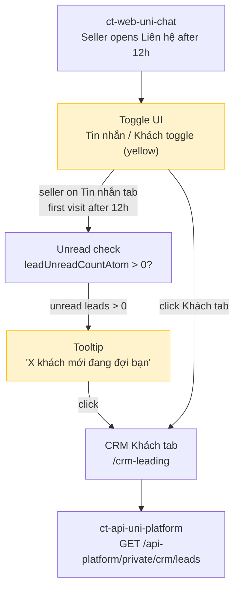

# MS-CORE-PLMO-1328: Redesign Khách Tab as a Toggle and show Contextual Tooltip

> **Package Version**: r1
> **Package Status**: Draft
> **Supersedes**: -
> **Source PRD**: `temp/PLMO-1328/prd.md` (STORY-001)

---

## 1. Document Metadata

| Field | Value |
|-------|-------|
| Feature ID | PLMO-1328 |
| Feature Name | Redesign Khách Tab as a Toggle and show Contextual Tooltip |
| Owner | Minh Tin Trieu |
| Package Version | r1 |
| Package Status | Draft |
| Source PRD | `temp/PLMO-1328/prd.md` (STORY-001) |
| Created | 2026-04-16 |
| Last Updated | 2026-04-16 |
| Approved At | — |

---

## 2. One-Minute Readout

- **Main change**: Redesign the Tin nhắn/Khách tab pair inside Chat as a toggle with yellow color (Mobile + Msite), and add a contextual tooltip on the Khách tab that appears on first daily visit to Liên hệ after 12h when unread leads exist.
- **Current package status**: Draft — 4 blocking open questions on tooltip trigger logic, state storage, experiment gating, and minimum unread threshold.
- **Main blockers**: OQ-001 (after 12h interpretation), OQ-002 (tooltip state storage), OQ-003 (tooltip experiment gating), OQ-004 (minimum unread threshold)
- **Backend impact**: Low. Existing APIs (`GET /crm/leads`, `crm_leads_unread_total_updated` socket) are reused. Primary new work is client-side UI + optional tooltip state persistence.
- **Supporting artifacts**: `knowledge.md`, `open-questions.md`, `api-contract.md`

---

## 3. What Changes

- **Toggle UI**: Tin nhắn / Khách tab pair → yellow toggle on Mobile and Msite
- **Tooltip**: Contextual tooltip on Khách tab — shows on first daily Liên hệ visit after 12h when unread leads exist
- **Tooltip content**: "X khách mới đang đợi bạn Nhấn để xem thông tin và tư vấn ngay"
- **Tooltip navigation**: Clicking tooltip navigates to Khách tab
- **Tooltip state**: Marked as shown when already displayed OR seller has visited Khách tab that day
- **Experiment gating**: Feature gated to `CT-PLATFORM.ab_collect_lead_lead_pty` treatment group (same as existing Khách tab)

---

## 4. Why

### 4.1 Business Objective

~50% of PTY sellers in the A/B treatment group are unaware of the Khách tab, missing leads and reducing consultation rates. Even sellers who discover it don't return daily due to no habit loop. This redesign increases tab discoverability through toggle design and proactively nudges first-time daily visitors with a tooltip.

### 4.2 Target Users

- PTY sellers in `CT-PLATFORM.ab_collect_lead_lead_pty` treatment group
- Sellers with unread CRM leads who primarily use the "Tin nhắn" tab

---

## 5. Shared Flow

### 5.1 Primary Flow



### 5.2 Flow Notes

- **Client surfaces**: ct-web-uni-chat — AppShell (toggle), CRMLeading page, UnreadCountProvider
- **Main services**: ct-api-uni-platform (CRM leads), ct-core-uni-crm (socket event)
- **Key API path**: `GET /api-platform/private/crm/leads` — existing, no change
- **New backend work**: Likely none — tooltip trigger logic and state are client-side unless OQ-002 resolves to server-side
- **Important alternate paths**: Control-group users (outside experiment) see neither toggle tooltip nor Khách tab access

---

## 6. Key Decisions

| Area | Current Decision | Status | Supporting Artifact |
|------|------------------|--------|---------------------|
| Toggle design | Yellow toggle for Khách tab (Mobile + Msite) | Confirmed (PRD) | PRD STORY-001, Figma 4474-5144 |
| Tooltip unread trigger | Reads `leadUnreadCountAtom` | Confirmed | api-contract.md API-002 |
| Tooltip state | Defaulting to client-side (localStorage) | Pending (OQ-002) | open-questions.md OQ-002 |
| Tooltip timing | "after 12h" — defaulting to 12:00 PM local time | Pending (OQ-001) | open-questions.md OQ-001 |
| Tooltip gating | Same experiment as Khách tab | Pending (OQ-003) | open-questions.md OQ-003 |
| Minimum unread threshold | Any unread lead (≥1) | Pending (OQ-004) | open-questions.md OQ-004 |

---

## 7. Blockers / Follow-Up

### 7.1 Blocking Items

| ID | What Still Needs A Decision | Current Handling | Supporting Artifact |
|----|-----------------------------|------------------|---------------------|
| OQ-001 | "after 12h" interpretation — calendar time vs 24h cooldown | Default to 12:00 PM local time | open-questions.md §3.2 |
| OQ-002 | Tooltip "shown today" state — client vs server storage | Default to client-side (localStorage) | open-questions.md §3.2, api-contract.md §3.1 |
| OQ-003 | Tooltip experiment gating — control group visibility | Tooltip hidden for control group | open-questions.md §3.2 |
| OQ-004 | Minimum unread threshold for tooltip trigger | Show for any unread lead (≥1) | open-questions.md §3.2 |

### 7.2 Non-Blocking Follow-Up

| ID / Ref | Follow-Up | Current Handling | Supporting Artifact |
|----------|-----------|------------------|---------------------|
| TEL-001 | Tooltip interaction ECS event — confirm with Data | No event defined yet | api-contract.md §4 |
| OQ-005 | "Liên hệ section" navigation anchor definition | Assumes full CRM page | open-questions.md §4.2 |
| OQ-006 | Tooltip dismissibility — re-show next day? | Re-shows next valid trigger | open-questions.md §4.2 |
| OQ-007 | Yellow toggle color — accessibility check | Apply per Figma; run contrast check | open-questions.md §4.2 |

---

## 8. Example Details

### 8.1 Example Summary

| Ref | Scenario | Why It Matters |
|-----|----------|----------------|
| EX-001 | Seller with unread leads opens Liên hệ after 12h for the first time | Tooltip should appear, navigate to Khách tab |
| EX-002 | Seller with unread leads revisits Liên hệ same day | Tooltip should not reappear |
| EX-003 | Seller with zero unread leads opens Liên hệ | Tooltip should not appear |

### 8.2 Example Details

#### EX-001 — First daily visit after 12h with unread leads

```gherkin
Given a seller is in the CT-PLATFORM.ab_collect_lead_lead_pty treatment group
And the current time is after 12:00 PM local time
And the seller has unread CRM leads (leadUnreadCountAtom > 0)
And the seller has not yet visited the Liên hệ section today
When the seller opens the Liên hệ section
Then the yellow toggle is displayed between Tin nhắn and Khách tabs
And the tooltip appears: "X khách mới đang đợi bạn Nhấn để xem thông tin và tư vấn ngay"
And the number X in the tooltip matches the badge count on the Khách tab
When the seller clicks the tooltip
Then the seller is navigated to the Khách tab
And the tooltip is marked as shown for today
```

- Notes: X = current unread lead count from `leadUnreadCountAtom`
- Supporting refs: PRD STORY-001, Figma 4474-5144

#### EX-002 — Seller revisits same day after tooltip was shown

```gherkin
Given a seller has already visited the Liên hệ section today
And the tooltip was already shown and marked as displayed
When the seller returns to the Liên hệ section later the same day
Then the tooltip is not shown again that day
```

- Notes: Relies on tooltip "shown today" state (OQ-002)
- Supporting refs: PRD STORY-001 — "Tooltip mark as shown when: has been shown"

#### EX-003 — Seller with zero unread leads

```gherkin
Given a seller has zero unread CRM leads
When the seller opens the Liên hệ section
Then the tooltip is not shown
And the Khách tab badge shows 0
```

- Notes: Tooltip trigger requires unread leads > 0
- Supporting refs: PRD STORY-001 trigger condition

---

## 9. Supporting Artifacts

| Artifact | Purpose | Notes |
|----------|---------|-------|
| `temp/PLMO-1328/jira-issue.json` | Jira snapshot | Issue metadata, links, assignees |
| `temp/PLMO-1328/prd.md` | Confluence PRD content | Full STORY-001 + related stories |
| `temp/PLMO-1328/prd-source.json` | PRD source metadata | Auto-detected slice match |
| `features/PLMO-1328/knowledge.md` | Supporting context | 4-pillar Knowledge Hub enrichment |
| `features/PLMO-1328/open-questions.md` | Ambiguity and blockers | 7 open questions (4 blocking, 3 non-blocking) |
| `features/PLMO-1328/api-contract.md` | API and backend contract | Confirmed reuse, pending decisions, service flow |
